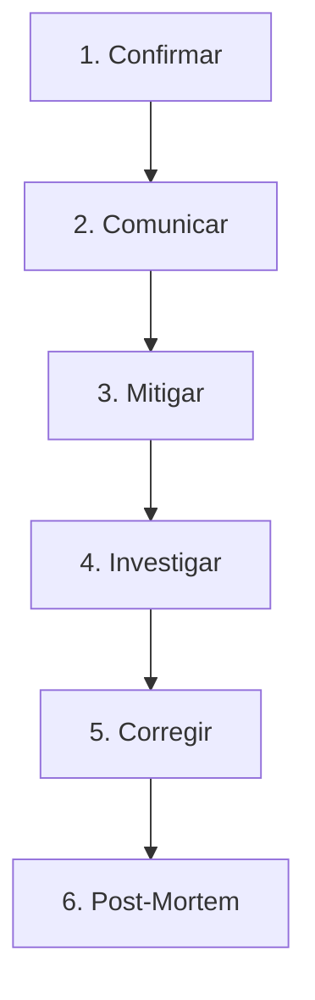

# Runbook de Respuesta a Incidentes (Incident Response)

Este runbook detalla los pasos que debes seguir como fundador ante una caída del sistema, fallas en pagos, alertas de fraude o cualquier incidente que afecte a los comercios o sus clientes.

---

## Proceso de 6 Pasos ante Incidentes



### Paso 1: Confirmar el impacto
Determina qué tan grave es la situación y a quiénes afecta:
* **Severidad 1 (S1 - Caída Total):** El dashboard de comercios (`/app/*`) o la app del cliente (`/check-in/*` / `/c/*`) no cargan. Afecta a todos.
* **Severidad 2 (S2 - Falla de Feature Crítica):** Los clientes no pueden registrar check-ins (no suma puntos) o el webhook de Wompi está fallando (no se activan suscripciones).
* **Severidad 3 (S3 - Degradación de Servicio):** El sistema responde lento o hay errores menores en vistas secundarias (p. ej., estadísticas o perfil).

### Paso 2: Comunicar
Mantén informados a los comercios para evitar llamadas de soporte masivas:
1. Actualiza la página de estado (en M3+: `status.sellio.co`).
2. Si afecta a un comercio específico (p. ej. error en su QR), escríbele directamente por WhatsApp:
   > *"Hola [Nombre]. Detectamos un problema temporal con la lectura de tarjetas digitales en nuestra plataforma. Ya estamos trabajando en solucionarlo. Te avisaré en cuanto esté resuelto. Disculpa las molestias."*
3. Evita dar explicaciones técnicas complejas. Enfócate en la solución.

### Paso 3: Mitigar (Frenar el sangrado)
El objetivo es restaurar el servicio lo más rápido posible, no encontrar la solución perfecta.
* **Si el último despliegue rompió algo:** Haz rollback al commit estable anterior inmediatamente desde el panel de Vercel.
* **Si es un fallo en una feature nueva:** Desactiva el flag correspondiente en la tabla `feature_flags` de Supabase:
  ```sql
  UPDATE public.feature_flags SET enabled_globally = false WHERE key = 'feature_problematico';
  ```
* **Si es saturación de peticiones (DDoS/Abuso):** Aumenta temporalmente el rate limiting en el Proxy o bloquea la IP ofensiva desde Cloudflare.

### Paso 4: Investigar (Causa Raíz)
Una vez el sistema esté estable, investiga el origen del problema:
1. **Sentry:** Revisa el dashboard de errores para buscar exceptions y stack traces.
2. **Supabase Database Logs:** Filtra peticiones lentas o errores SQL.
3. **Wompi Webhook Events:** Revisa la tabla `webhook_events` para ver los payloads recibidos y si la columna `error` contiene descripciones de fallos.

### Paso 5: Corregir (Resolución Permanente)
1. Desarrolla la corrección en tu entorno local.
2. Escribe una prueba unitaria o de integración que replique el escenario de falla para evitar regresiones.
3. Haz merge de la corrección a `main` y deja que el CI/CD realice el despliegue automático.
4. Verifica en producción que el error ya no ocurra.

### Paso 6: Post-Mortem
Escribe una breve retrospectiva en `docs/incidents/YYYY-MM-DD-[nombre-del-incidente].md`:
* ¿Qué pasó? (Línea de tiempo)
* ¿Cuál fue el impacto real? (Comercios y clientes afectados)
* ¿Cuál fue la causa raíz?
* ¿Qué haremos para prevenir que vuelva a ocurrir? (Acciones concretas)

---

## Escenarios Comunes y Cómo Resolverlos

### Escenario A: Wompi reporta pago aprobado pero la suscripción sigue inactiva
1. Ve al panel de Wompi Sandbox/Producción y busca la transacción aprobada. Copia la referencia.
2. Abre la consola de Supabase y busca el registro en `webhook_events` usando la referencia (o ID de transacción).
3. Si el campo `processed_at` está vacío y `error` tiene contenido:
   * Corrige la causa del error en base de datos o código.
   * Puedes simular un reenvío del webhook usando el payload de `webhook_events` o presionando "Reenviar Webhook" desde el dashboard de Wompi.
4. Si el evento no existe en `webhook_events`:
   * Wompi no pudo contactar con Sellio (caída de red/Vercel).
   * Reenvía el webhook manualmente desde el panel de Wompi.

### Escenario B: Un cliente reclama que no se le sumaron puntos tras escanear
1. En el dashboard de comercio, busca el número de teléfono del cliente en la lista de clientes.
2. Revisa el historial de check-ins. Si se rechazó, revisa en Sentry si saltó el rate limit por IP o por tiempo (1 check-in por org cada 30 min).
3. Si fue un error del sistema, puedes sumarle los puntos manualmente desde el panel del comercio (esta acción genera una transacción de tipo `adjust` de forma segura).

---

## Contactos de Emergencia
* **Soporte Supabase:** https://supabase.com/dashboard/support/new
* **Soporte Wompi:** https://soporte.wompi.co/
* **Soporte Vercel (Uptime):** https://vercel-status.com/
